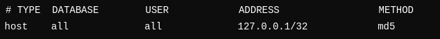
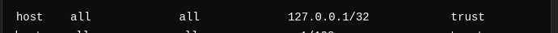

# Video content tables

1. use your path in file get_data_for_OLTP_table_from_CSV.sql (OLTP folder).

2. use your db_name and user_name in file transfer_data_from_OLTP_to_OLAP_using_dblink.sql (OLAP folder). Go to pg_hba.conf in your locale PC and write "trust" inside METOD column.

### Example:

